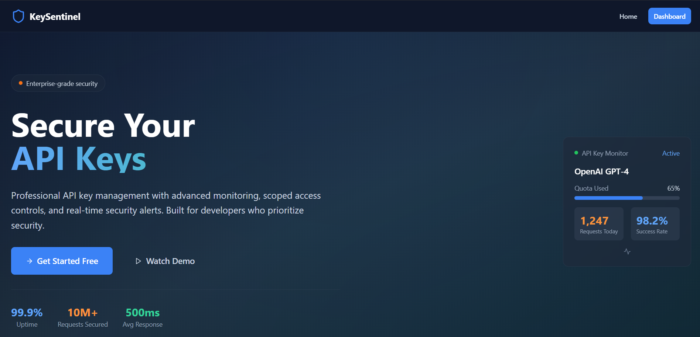
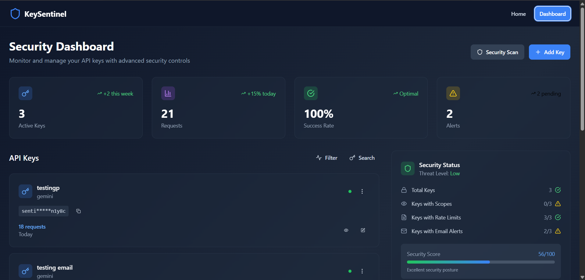
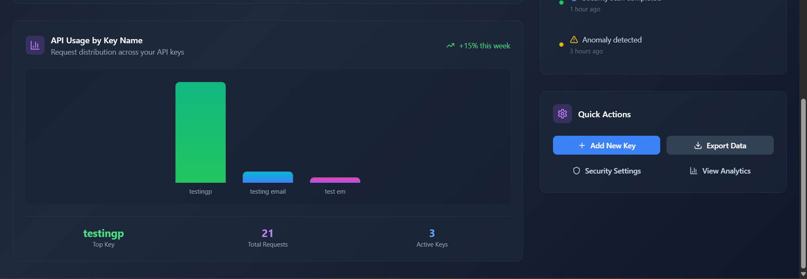
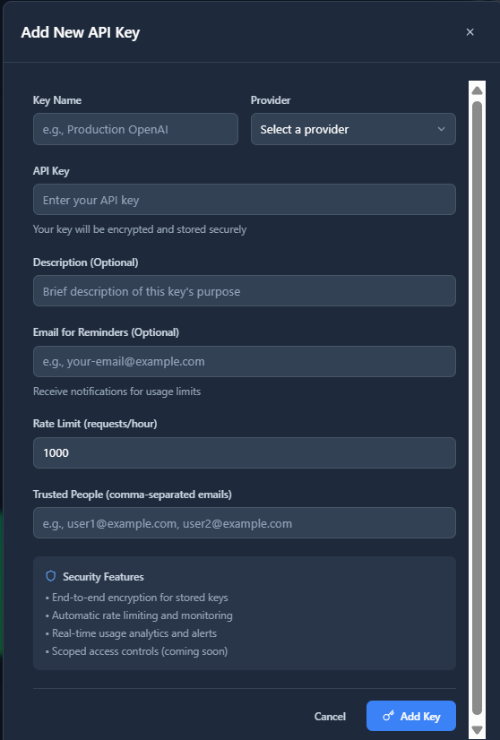
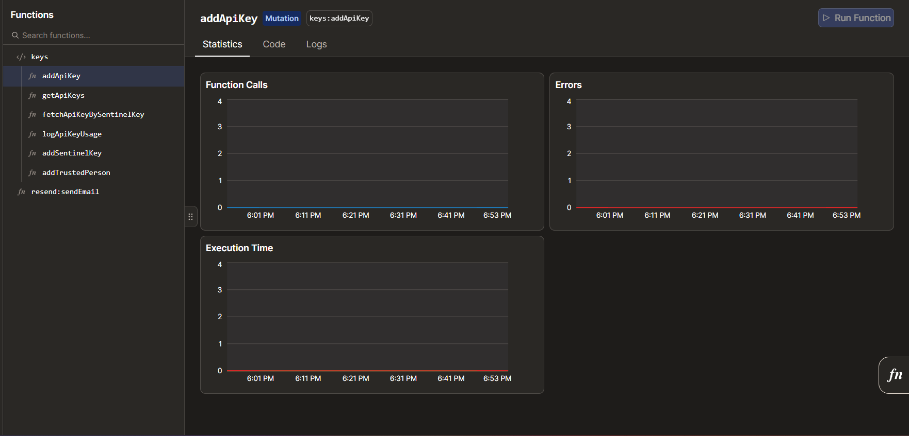
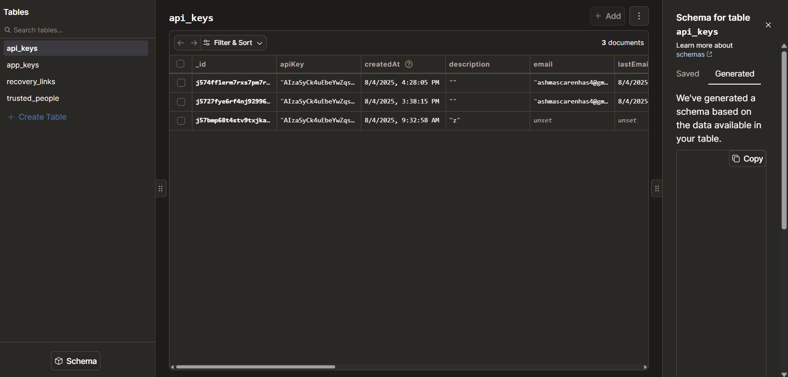
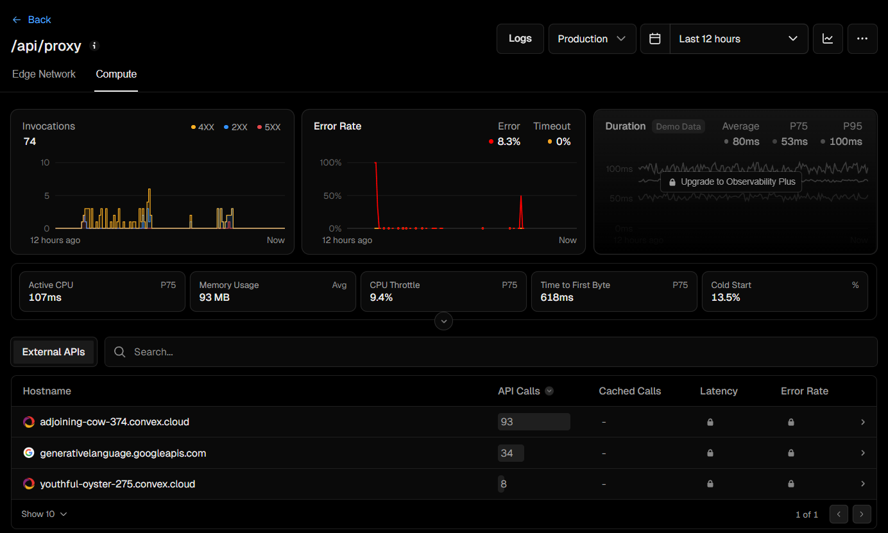

<!-- Improved compatibility of back to top link: See: https://github.com/othneildrew/Best-README-Template/pull/73 -->
<a id="readme-top"></a>

<!-- PROJECT SHIELDS -->
[![Contributors][contributors-shield]][contributors-url]
[![Forks][forks-shield]][forks-url]
[![Stargazers][stars-shield]][stars-url]
[![Issues][issues-shield]][issues-url]
[![MIT License][license-shield]][license-url]
[![LinkedIn][linkedin-shield]][linkedin-url]

<!-- PROJECT LOGO -->
<br />
<div align="center">
  <a href="https://github.com/your-username/keysentinel">
    
  </a>

  <h3 align="center">KeySentinel</h3>

  <p align="center">
    Enterprise-grade API Key Management with Advanced Security & Monitoring
    <br />
    <a href="https://github.com/your-username/keysentinel"><strong>Explore the docs »</strong></a>
    <br />
    <br />
    <a href="https://github.com/your-username/keysentinel">View Demo</a>
    &middot;
    <a href="https://github.com/your-username/keysentinel/issues/new?labels=bug&template=bug-report---.md">Report Bug</a>
    &middot;
    <a href="https://github.com/your-username/keysentinel/issues/new?labels=enhancement&template=feature-request---.md">Request Feature</a>
  </p>
</div>

<!-- TABLE OF CONTENTS -->
<details>
  <summary>Table of Contents</summary>
  <ol>
    <li>
      <a href="#about-the-project">About The Project</a>
      <ul>
        <li><a href="#built-with">Built With</a></li>
      </ul>
    </li>
    <li>
      <a href="#screenshots--features">Screenshots & Features</a>
      <ul>
        <li><a href="#frontend-features">Frontend Features</a></li>
        <li><a href="#backend-features">Backend Features</a></li>
        <li><a href="#database-features">Database Features</a></li>
      </ul>
    </li>
    <li>
      <a href="#getting-started">Getting Started</a>
      <ul>
        <li><a href="#prerequisites">Prerequisites</a></li>
        <li><a href="#installation">Installation</a></li>
      </ul>
    </li>
    <li><a href="#usage">Usage</a></li>
    <li><a href="#system-architecture">System Architecture</a></li>
    <li><a href="#roadmap">Roadmap</a></li>
    <li><a href="#contributing">Contributing</a></li>
    <li><a href="#license">License</a></li>
    <li><a href="#contact">Contact</a></li>
    <li><a href="#acknowledgments">Acknowledgments</a></li>
  </ol>
</details>

<!-- ABOUT THE PROJECT -->
## About The Project

[![KeySentinel Landing Page][product-screenshot]](https://github.com/your-username/keysentinel)

KeySentinel is a professional API key management platform designed for developers and teams who prioritize security and operational visibility. The application features a modern React frontend with a Convex serverless backend, utilizing advanced monitoring, scoped access controls, and real-time security alerts.

**Key Features:**
* **Enterprise-grade Security**: End-to-end encryption for stored API keys
* **Real-time Monitoring**: Advanced analytics dashboard with usage tracking
* **Scoped Access Controls**: Granular permissions and rate limiting
* **Email Alerts**: Automated notifications for usage thresholds
* **Multi-Provider Support**: OpenAI, Gemini, and other API providers
* **Trusted People Management**: Shared access controls for teams
* **Security Scoring**: Comprehensive security posture assessment

<p align="right">(<a href="#readme-top">back to top</a>)</p>

### Built With

This section should list any major frameworks/libraries used to bootstrap your project.

* [![React][React.js]][React-url]
* [![TypeScript][TypeScript]][TypeScript-url]
* [![Convex][Convex]][Convex-url]
* [![Vercel][Vercel]][Vercel-url]
* [![Tailwind CSS][Tailwind CSS]][Tailwind-url]
* [![Vite][Vite]][Vite-url]
* [![Resend][Resend]][Resend-url]
* [![Framer Motion][Framer Motion]][Framer-url]

<p align="right">(<a href="#readme-top">back to top</a>)</p>

<!-- SCREENSHOTS & FEATURES -->
## Screenshots & Features

### Frontend Features

#### Landing Page - Professional API Key Management


**Features showcased:**
- **Modern Dark Theme**: Professional dark blue background with white, blue, and orange accents
- **Clear Value Proposition**: "Secure Your API Keys" with enterprise-grade security messaging
- **Key Statistics**: 99.9% Uptime, 10M+ Requests Secured, 500ms Avg Response
- **Call-to-Action**: Prominent "Get Started Free" and "Watch Demo" buttons
- **API Key Monitor**: Real-time monitoring panel showing OpenAI GPT-4 usage (65% quota used, 1,247 requests today, 98.2% success rate)

#### Security Dashboard - Comprehensive Monitoring


**Features showcased:**
- **Dashboard Metrics**: Active Keys (3), Requests (21), Success Rate (100%), Alerts (2 pending)
- **API Keys Management**: List view with key names, providers, masked keys, and usage stats
- **Security Status**: Threat Level Low, Security Score 56/100 with detailed security checks
- **Quick Actions**: Security Scan and Add Key buttons for immediate actions
- **Filter & Search**: Advanced filtering and search capabilities for key management

#### Analytics Dashboard - Usage Insights


**Features showcased:**
- **API Usage by Key Name**: Bar chart showing request distribution across API keys
- **Performance Metrics**: Top Key highlighting, Total Requests (21), Active Keys (3)
- **Notifications Panel**: Security scan completion and anomaly detection alerts
- **Quick Actions**: Add New Key, Export Data, Security Settings, and View Analytics options
- **Real-time Updates**: Live data with +15% weekly growth indicators

#### Add New API Key Modal - Secure Key Management


**Features showcased:**
- **Comprehensive Form**: Key name, provider selection, API key input, description, email reminders
- **Rate Limiting**: Configurable requests per hour (default 1000)
- **Trusted People**: Comma-separated email list for shared access
- **Security Features**: End-to-end encryption, automatic rate limiting, real-time analytics, scoped access controls
- **User-Friendly Interface**: Clean modal design with clear input validation

### Backend Features

#### Convex Backend - Serverless Database & Functions


**Backend Features showcased:**
- **Serverless Functions**: addApiKey, getApiKeys, fetchApiKeyBySentinelKey, logApiKeyUsage
- **Real-time Database**: Convex database with automatic synchronization
- **Function Monitoring**: Statistics, code, and logs tabs for development
- **Type-safe Operations**: Full TypeScript support with generated types
- **Scalable Architecture**: Serverless functions with automatic scaling

#### Convex Database Schema - Data Structure


**Database Features showcased:**
- **API Keys Table**: Complete key management with encryption, rate limits, and usage tracking
- **Schema Management**: Generated schema based on data with copy functionality
- **Data Relationships**: Links between api_keys, app_keys, trusted_people, and recovery_links
- **Real-time Updates**: Automatic synchronization across all connected clients
- **Scalable Storage**: NoSQL database optimized for real-time applications

### API Routing & Hosting

#### Vercel API Route - Proxy Performance Monitoring


**API Features showcased:**
- **Compute Performance**: 74 total invocations with detailed metrics
- **Error Rate Monitoring**: 8.3% error rate with timeout tracking
- **Response Time**: Average 80ms, P75 53ms, P95 100ms
- **External API Integration**: Calls to Convex Cloud, Google Generative Language API
- **Resource Usage**: CPU, memory, and cold start metrics
- **Production Monitoring**: Real-time performance tracking in production environment

<p align="right">(<a href="#readme-top">back to top</a>)</p>

<!-- GETTING STARTED -->
## Getting Started

This is an example of how you may give instructions on setting up your project locally.
To get a local copy up and running follow these simple example steps.

### Prerequisites

This is an example of how to list things you need to use the software and how to install them.
* npm
  ```sh
  npm install npm@latest -g
  ```
* Node.js (v18 or higher)
* Convex account and project
* Vercel account for deployment
* Resend account for email services

### Installation

1. Clone the repo
   ```sh
   git clone https://github.com/your-username/keysentinel.git
   ```
2. Install NPM packages
   ```sh
   npm install
   ```
3. Set up environment variables
   ```sh
   cp .env.example .env
   ```
4. Configure your environment variables in `.env`
   ```js
   NEXT_PUBLIC_CONVEX_URL=your_convex_url
   RESEND_API_KEY=your_resend_api_key
   ```
5. Set up Convex backend
   ```sh
   npx convex dev
   ```
6. Start the development server
   ```sh
   npm run dev
   ```

<p align="right">(<a href="#readme-top">back to top</a>)</p>

<!-- USAGE EXAMPLES -->
## Usage

KeySentinel is designed for developers and teams who need secure, scalable API key management.

**For Development Teams:**
- Centralize API key management across multiple projects
- Monitor usage and costs in real-time
- Set up automated alerts for usage thresholds
- Share access with trusted team members

**For Security Teams:**
- Implement scoped access controls
- Monitor for unusual usage patterns
- Maintain audit trails of all API key usage
- Enforce rate limiting and security policies

**For DevOps Teams:**
- Automate API key rotation
- Integrate with CI/CD pipelines
- Monitor performance and uptime
- Scale infrastructure automatically

_For more examples, please refer to the [Documentation](https://github.com/your-username/keysentinel)_

<p align="right">(<a href="#readme-top">back to top</a>)</p>

<!-- SYSTEM ARCHITECTURE -->
## System Architecture

### Frontend Architecture
- **Framework**: React 18 with TypeScript
- **Build Tool**: Vite for fast development and optimized builds
- **Styling**: Tailwind CSS with custom color schemes and animations
- **UI Components**: Custom components with Framer Motion animations
- **State Management**: React hooks with Convex real-time subscriptions
- **Form Handling**: React Hook Form with Zod validation
- **Charts**: Recharts for data visualization
- **Notifications**: Sonner for toast notifications

### Backend Architecture
- **Platform**: Convex serverless backend
- **Language**: TypeScript with strict type checking
- **Database**: Convex NoSQL database with real-time synchronization
- **Functions**: Serverless mutations and queries for data operations
- **Scheduling**: Built-in scheduler for automated tasks (email alerts)
- **Real-time**: Automatic real-time updates across all clients

### Database Architecture
- **Database**: Convex NoSQL database
- **Schema**: Type-safe schema definitions with validation
- **Tables**: api_keys, app_keys, trusted_people, recovery_links
- **Indexing**: Optimized indexes for fast queries
- **Relationships**: Foreign key relationships between tables

### API Architecture
- **Proxy Service**: Vercel serverless function (/api/proxy.js)
- **Security**: App key validation and provider verification
- **External APIs**: Support for OpenAI, Gemini, and other providers
- **Rate Limiting**: Automatic usage tracking and limits
- **Monitoring**: Real-time performance metrics and error tracking

### Key Components

#### Data Models
- **API Keys**: Core entities with encryption, rate limits, and usage tracking
- **App Keys**: Public-facing proxy keys for secure API access
- **Trusted People**: Shared access controls for team collaboration
- **Recovery Links**: Secure token-based recovery system

#### Security Features
- **Encryption**: End-to-end encryption for stored API keys
- **Access Control**: Scoped permissions and rate limiting
- **Monitoring**: Real-time usage analytics and anomaly detection
- **Alerts**: Automated email notifications for security events

#### UI Components
- **Dashboard**: Real-time monitoring and analytics
- **Key Management**: Add, edit, and delete API keys
- **Security Center**: Comprehensive security scoring and recommendations
- **Analytics**: Usage charts and performance metrics

### Data Flow

#### API Key Creation Flow
1. User fills out the "Add New API Key" form
2. Form validation using Zod schemas
3. Convex mutation creates new API key record
4. App key (sentinel key) generated for secure access
5. Key appears in dashboard with real-time updates

#### API Request Flow
1. Client sends request to Vercel proxy with app key
2. Proxy validates app key via Convex query
3. Proxy forwards request to external API (OpenAI, Gemini, etc.)
4. Usage logged via Convex mutation
5. Response returned to client with monitoring data

#### Security Monitoring Flow
1. Real-time usage tracking in Convex database
2. Security scoring based on key configuration
3. Automated alerts when thresholds exceeded
4. Email notifications sent via Resend service
5. Dashboard updates with latest security status

### External Dependencies

#### Core Dependencies
- **React Ecosystem**: React 18, React DOM, React Hook Form
- **Backend**: Convex for serverless functions and database
- **Styling**: Tailwind CSS, Framer Motion, Lucide React
- **Validation**: Zod for schema validation
- **Charts**: Recharts for data visualization
- **Email**: Resend for automated notifications

#### Development Dependencies
- **Build Tools**: Vite with React plugin, TypeScript
- **Linting**: ESLint with React and TypeScript rules
- **Styling**: PostCSS, Autoprefixer for CSS processing

### Deployment Strategy

#### Development Environment
- **Local Development**: Vite dev server with hot module replacement
- **Backend**: Convex dev environment with local database
- **Real-time**: Automatic synchronization between frontend and backend

#### Production Deployment
- **Frontend**: Vercel deployment with optimized builds
- **Backend**: Convex production environment
- **API Routes**: Vercel serverless functions for proxy service
- **Database**: Convex production database with automatic scaling

#### Monitoring & Analytics
- **Performance**: Vercel Analytics for frontend and API monitoring
- **Errors**: Automatic error tracking and alerting
- **Usage**: Real-time usage analytics and cost tracking
- **Security**: Comprehensive security scoring and recommendations

<p align="right">(<a href="#readme-top">back to top</a>)</p>

<!-- ROADMAP -->
## Roadmap

- [x] API Key Management System
- [x] Real-time Dashboard
- [x] Security Monitoring
- [x] Email Alerts
- [x] Multi-provider Support
- [x] Convex Backend Integration
- [x] Vercel API Proxy
- [ ] Advanced Analytics
- [ ] Team Collaboration Features
- [ ] API Key Rotation
- [ ] Audit Logging
- [ ] Mobile Application
- [ ] Webhook Integrations
- [ ] Advanced Security Features

See the [open issues](https://github.com/your-username/keysentinel/issues) for a full list of proposed features (and known issues).

<p align="right">(<a href="#readme-top">back to top</a>)</p>

<!-- CONTRIBUTING -->
## Contributing

Contributions are what make the open source community such an amazing place to learn, inspire, and create. Any contributions you make are **greatly appreciated**.

If you have a suggestion that would make this better, please fork the repo and create a pull request. You can also simply open an issue with the tag "enhancement".
Don't forget to give the project a star! Thanks again!

1. Fork the Project
2. Create your Feature Branch (`git checkout -b feature/AmazingFeature`)
3. Commit your Changes (`git commit -m 'Add some AmazingFeature'`)
4. Push to the Branch (`git push origin feature/AmazingFeature`)
5. Open a Pull Request

### Top contributors:

<a href="https://github.com/your-username/keysentinel/graphs/contributors">
  
</a>

<p align="right">(<a href="#readme-top">back to top</a>)</p>

<!-- LICENSE -->
## License

Distributed under the MIT License. See `LICENSE.txt` for more information.

<p align="right">(<a href="#readme-top">back to top</a>)</p>

<!-- CONTACT -->
## Contact

Tyrone Crasto - [@tyrone_crasto](https://twitter.com/tyrone_crasto) - tyrone.crasto@example.com

Project Link: [https://github.com/your-username/keysentinel](https://github.com/your-username/keysentinel)

<p align="right">(<a href="#readme-top">back to top</a>)</p>

<!-- ACKNOWLEDGMENTS -->
## Acknowledgments

Use this space to list resources you find helpful and would like to give credit to. I've included a few of my favorites to kick things off!

* [Choose an Open Source License](https://choosealicense.com)
* [GitHub Emoji Cheat Sheet](https://www.webpagefx.com/tools/emoji-cheat-sheet)
* [Malven's Flexbox Cheatsheet](https://flexbox.malven.co/)
* [Malven's Grid Cheatsheet](https://grid.malven.co/)
* [Img Shields](https://shields.io)
* [GitHub Pages](https://pages.github.com)
* [Font Awesome](https://fontawesome.com)
* [React Icons](https://react-icons.github.io/react-icons/search)
* [Convex](https://convex.dev)
* [Vercel](https://vercel.com)
* [Resend](https://resend.com)
* [Tailwind CSS](https://tailwindcss.com)
* [Framer Motion](https://www.framer.com/motion/)
* [Recharts](https://recharts.org)
* [Zod](https://zod.dev)

<p align="right">(<a href="#readme-top">back to top</a>)</p>

<!-- MARKDOWN LINKS & IMAGES -->
<!-- https://www.markdownguide.org/basic-syntax/#reference-style-links -->
[contributors-shield]: https://img.shields.io/github/contributors/your-username/keysentinel.svg?style=for-the-badge
[contributors-url]: https://github.com/your-username/keysentinel/graphs/contributors
[forks-shield]: https://img.shields.io/github/forks/your-username/keysentinel.svg?style=for-the-badge
[forks-url]: https://github.com/your-username/keysentinel/network/members
[stars-shield]: https://img.shields.io/github/stars/your-username/keysentinel.svg?style=for-the-badge
[stars-url]: https://github.com/your-username/keysentinel/stargazers
[issues-shield]: https://img.shields.io/github/issues/your-username/keysentinel.svg?style=for-the-badge
[issues-url]: https://github.com/your-username/keysentinel/issues
[license-shield]: https://img.shields.io/github/license/your-username/keysentinel.svg?style=for-the-badge
[license-url]: https://github.com/your-username/keysentinel/blob/master/LICENSE.txt
[linkedin-shield]: https://img.shields.io/badge/-LinkedIn-black.svg?style=for-the-badge&logo=linkedin&colorB=555
[linkedin-url]: www.linkedin.com/in/tyrone-crasto
[product-screenshot]: screenshots/landing-page.png
[React.js]: https://img.shields.io/badge/React-20232A?style=for-the-badge&logo=react&logoColor=61DAFB
[React-url]: https://reactjs.org/
[TypeScript]: https://img.shields.io/badge/TypeScript-007ACC?style=for-the-badge&logo=typescript&logoColor=white
[TypeScript-url]: https://www.typescriptlang.org/
[Convex]: https://img.shields.io/badge/Convex-00C4B4?style=for-the-badge&logo=convex&logoColor=white
[Convex-url]: https://convex.dev/
[Vercel]: https://img.shields.io/badge/Vercel-000000?style=for-the-badge&logo=vercel&logoColor=white
[Vercel-url]: https://vercel.com/
[Tailwind CSS]: https://img.shields.io/badge/Tailwind_CSS-38B2AC?style=for-the-badge&logo=tailwind-css&logoColor=white
[Tailwind-url]: https://tailwindcss.com/
[Vite]: https://img.shields.io/badge/Vite-646CFF?style=for-the-badge&logo=vite&logoColor=white
[Vite-url]: https://vitejs.dev/
[Resend]: https://img.shields.io/badge/Resend-00C4B4?style=for-the-badge&logo=resend&logoColor=white
[Resend-url]: https://resend.com/
[Framer Motion]: https://img.shields.io/badge/Framer_Motion-0055FF?style=for-the-badge&logo=framer&logoColor=white
[Framer-url]: https://www.framer.com/motion/
